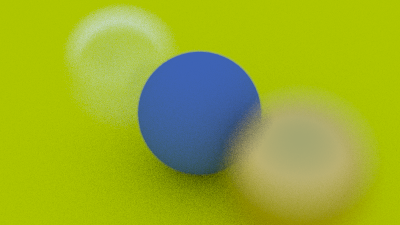

# toytracer

This project contains my implementation of [Ray Tracing in One Weekend](https://raytracing.github.io/books/RayTracingInOneWeekend.html) written in Rust.

This is what the current result looks like:

